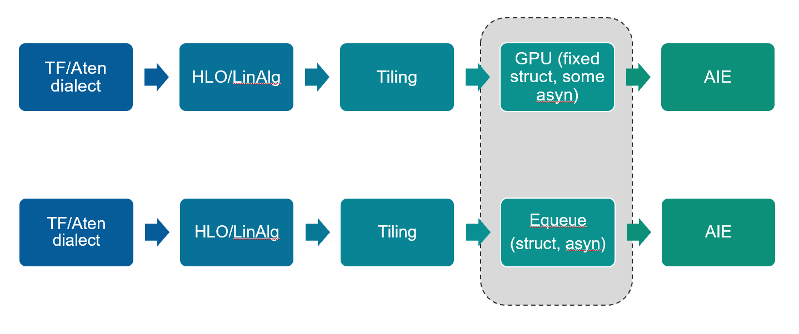

# Event Queue Dialect
Event queue (Equeue) dialect is an MLIR Dialect that models concurrent devices in terms of control and structure.


### Motivation

The main motivation of the event queue dialect is to efficiently estimate performance of programs running on heterogenous accelerators. The dialect is designed to bridge the gap between low-level hardware specific dialects and high-level dialects with little hardware specific information, thus facilitating custom lowering among different design choices. In particular, the EventQueue dialect supports modeling memory size constraints, bandwidth constraints, and processing time across a large number of heterogenous processors with distributed event-based control.

By and large, event queue dialect is design to estimate performance of concurrent devices. It supports:

- Arbitrary hardware hierarchy and each hardware with its own properties.

-  Modeling data movement and buffer allocation that is critical to energy and efficiency estimation.

- Model concurrency between heterogenous devices.

Check [further documentation](mydoc/) to see how the goals are achieved. 


### EQueue Dialect in MLIR Lowering Pipeline



Event queue dialect is designed to do performance analysis.

Because there is a gap between high level dialect that has no structure information, and low level dialect that is too detail to analyze, event queue dialect bridges them.

The input for the event queue dialect is high level control dialect without structure and the output will be dialect describing detailed structure information.

In the lowering pipeline, equeue dialect is at the same level as [gpu dialect](https://mlir.llvm.org/docs/Dialects/GPU/). The difference is that existing gpu dialect assumes a synchronous gpu model and try to communicate with `gpu.barrier` among concurrent gpus, while equeue dialect models a more general design, where it allows any kinds of structure, thus allowing maximum *flexibility*. To describe the complexity of any possible structure in a flexible device like FPGA, equeue dialect develops a general semantics for asynchronous communication between concurrent devices.


### How to Use

#### Quick Start

You may want to check on [Examples](example) on the convolution and the finite impulse response.

After `git clone` and `cd` the repo, 

```shell
mkdir build
cp *.sh build/
cd build
#change LLVM_DIR and MLIR_DIR in run.sh to your local directory
sh config; sh run.sh
./bin/equeue-opt ../test/Equeue/[path-to-input-file.mlir]
```

#### Debug Outputs

If one want to turn on debug outputs with `-debug` or `debug-only` when there are multiple debugging options

```shell
./bin/equeue-opt ../test/Equeue/[path-to-input-file.mlir] -debug
# when there are multiple debugging options
./bin/equeue-opt ../test/Equeue/[path-to-input-file.mlir] -debug-only=command_processor
# to redirect output to file
./bin/equeue-opt ../test/Equeue/[path-to-input-file.mlir] -debug > & report
```

### Visualization

By default `equeue-opt` will generate a [Trace Event Format](https://docs.google.com/document/d/1CvAClvFfyA5R-PhYUmn5OOQtYMH4h6I0nSsKchNAySU/preview) JSON file to `test/Equeue/out.json` . You can specify the output file name with `-json` 

```shell
./bin/equeue-opt ../test/Equeue/[path-to-input-file.mlir] -json [path-to-json-file.json]
```

The output JSON file can be viewed in [chrome://tracing/](chrome://tracing/)  

Below is the visualization of running `test/EQueue/gpu.mlir`  


### Contact

I am [Zhijing](https://tissue3.github.io/) at Cornell University. This project is originally my Xilinx internship project. I extend after the internship and now it is accepted by HPCA 2022. I will put the reference later. If getting to any trouble, you can contact me at zl679@cornell.edu

