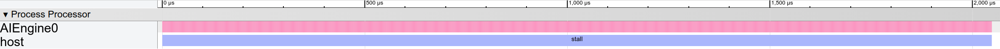

# Unlimited Resources

We start with a basic 1-processor implementation and use empirical measurements to improve the design. 

### Structural Modeling 

The structure for one AI engine is extremely simple:

```c#
proc = create_proc("AIEngine");
data = create_mem({32}, 32, "RegisterFile");//delay line
taps = create_mem({32}, 32, "RegisterFile");//coeff
acc = create_mem({4}, 32, "RegisterFile");//coeff

ai_engine = create_comp({"proc", "data", "taps", "acc"}, {proc, data, taps, acc};
```


### Control Flow

We can use the AI Engine’s intrinsics: `mul4` and `mac4`. On each cycle, mul4 computes on 4 parallel lanes to perform 8 multiplications where each lane performs 2. `mac4` works in the same way.
Analytically, therefore, it should take **16 cycles** to compute 4 outputs for a filter length of 32.

We can use `equeue.op` to self-define mul4 with `equeue.op("mul4", {ofmap, ifmap, filter})` . In the simulator library, an operation with the “mul4” signature reads from a buffer, computes 4 lanes with 2 computation at each lane per cycle, and writes to the buffer. We define the mac4 operation the same way. 

The following pseudo code shows the MLIR generator for a single-core implementation, where ifmap , ofmap and filter are buffers.

```c#
start = equeue.control_start()
equeue.launch(...) in (start, proc){
    equeue.op("mul4", {ofmap, ifmap, filter})
    for 0 to 11:
        equeue.op("mac4", {ofmap, ifmap, filter})
        ifmap_tensor = equeue.read(sin)
        equeue.write(ifmap_tensor, ifmap)
    for 0 to 4:
        equeue.op("mac4", {ofmap, ifmap, filter})
        ofmap_tensor = equeue.read(ofmap);
        equeue.write(ofmap_tensor, sout)
}
```


### How to Run

First use [generator](singleKernel) to generate a single kernel implementation.

```shell
./bin/equeue-opt -generate=firSingle > [filename].mlir
```

Next step is to simulate the generated MLIR file with

```shell
./bin/equeue-opt [filename].mlir -simulate -show-col-name -json=[json_filename].json 
```


### Simulation and Visualization

We can put on [chrome://tracing](tracing) to visualize the output JSON in [event trace format](https://docs.google.com/document/d/1CvAClvFfyA5R-PhYUmn5OOQtYMH4h6I0nSsKchNAySU/preview).



Our EQueue simulation reports 2048 cycles to generate 512 outputs, close to Xilinx AI Engine simulator’s result of 2276 cycles. The Xilinx simulator also models other factors in performance, including loop control costs, synchronization overhead, etc. The EQueue simulation engine’s throughput is slightly higher because it does not model these overheads.