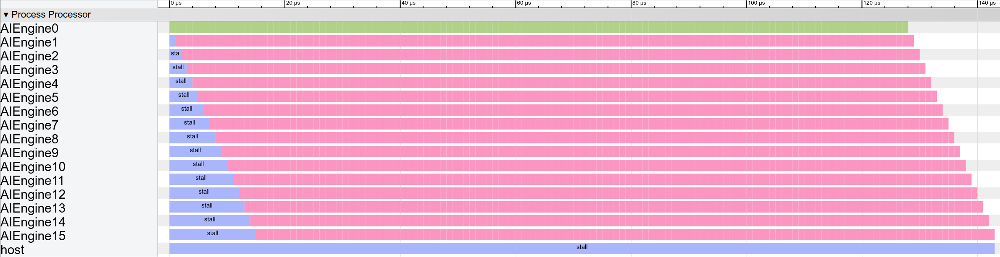

# Optimizing the Single Kernel

The next step for a hardware designer is to incrementally increase the design’s complexity to attain higher throughput. 

In an ideal world, since `mul4`/`mac4` computes 4 lanes, each with 2 operation per cycle, we could pipeline 32/2 = 16 processors to maximize throughput. 

Due to bandwidth constraints, Xilinx’s FIR tutorial simulates 4 processors rather than 16. Using the EQueue model, we can first model the full 16-processor pipelined system and then introduce more realistic constraints to measure their effect on performance.

### Structural Modeling 

The structure for 16 AI engine is again, simple, with the generator. We just need a `for` loop to get as many AI Engines as we want.

```c#
aie_array = create_comp()
for i in 0 to 16:
    proc = create_proc("AIEngine");
    data = create_mem({32}, 32, "RegisterFile");//delay line
    taps = create_mem({32}, 32, "RegisterFile");//coeff
    acc = create_mem({4}, 32, "RegisterFile");//coeff
	ai_engine = create_comp({"proc", "data", "taps", "acc"}, 
                            {proc, data, taps, acc}
    aie_array = add_comp({"aie_"+str(i)}, ai_engine)
```


### Control Flow

The modification to our EQueue program is straightforward. Instead of one processor executing 16 sequential operations, we now create 16 processors, where each processor completes
one mul4 / mac4 operation. We show the simplified control flow:

```c#
start = equeue.control_start()
for k in 0 .. 16:
    done[k] = equeue.launch(...) in (start, ai_engine[k]){
        ifmap_tensor = equeue.read(sin)
        equeue.write(ifmap_tensor, ifmap)
        equeue.op("mac4", {ofmap, ifmap, filter})
        ofmap_tensor = equeue.read(ofmap);
        equeue.write(ofmap_tensor, sout)
	}
equeue.await(done)
```


### How to Run

First use [generator](singleKernel) to generate a 16 kernel implementation.

```shell
./bin/equeue-opt -generate=fir16 > [filename].mlir
```

Next step is to simulate the generated MLIR file with

```shell
./bin/equeue-opt [filename].mlir -simulate -show-col-name -json=[json_filename].json 
```


### Simulation and Visualization

We can put on [chrome://tracing](tracing) to visualize the output JSON in [event trace format](https://docs.google.com/document/d/1CvAClvFfyA5R-PhYUmn5OOQtYMH4h6I0nSsKchNAySU/preview).



The simulation engine reports 143 cycles to produce outputs for 512 inputs. This matches the expected performance because pipelining 16 processors requires 15 cycles to warm up.
