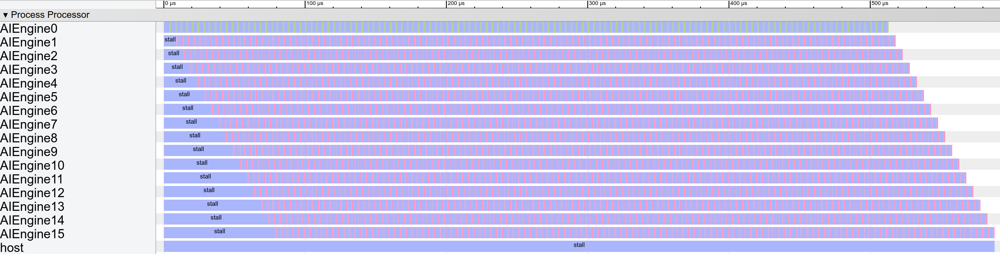

# Limited Bandwidth

So far we are modeling with no constraints. This is ideal case. But in reality, we also need to consider constraints, e.g. bandwidth.

The AI Engine is constrained by the 32-bit bandwidth of its AXI4-Stream I/O interfaces. To add bandwidth constraints, we need only add a connection component and update the reads and writes accordingly:

### Structural Modeling 

We model the connection component as a pipe, every `equeue.read` and `equeue.write` can put data into the pipe. "Streaming" means it has no read/write lock and maintains two pointers to the current byte for read and write.

```c#
for i in 0 to 16:
    proc = create_proc("AIEngine");
    data = create_mem({32}, 32, "RegisterFile");//delay line
    taps = create_mem({32}, 32, "RegisterFile");//coeff
    acc = create_mem({4}, 32, "RegisterFile");//coeff
	// Add connection component.
	conn_in = connection("Streaming", 32);
	conn_out = connection("Streaming", 32);
	ai_engine = create_comp({"proc", "data", "taps", "acc", "cin","cout"}, 
                            {proc, data, taps, acc, cin, cout};
    aie_array = add_comp({"aie_"+str(i)}, ai_engine)
```


### Control Flow

After connection definition, we can add the connection into `equeue.read` and `equeue.write` when we the communication comes from the external connection.

```c#
start = equeue.control_start()
for k in 0..16:
    done[k] = equeue.launch(...) in (start, ai_engine[k]){
        ifmap_tensor = equeue.read(sin)
        equeue.write(ifmap_tensor, ifmap, conn_in) // Add the connection pipe
        equeue.op("mac4", {ofmap, ifmap, filter})
        ofmap_tensor = equeue.read(ofmap) 
        equeue.write(ofmap_tensor, sout, conn_out) // Add the connection pipe
	}
equeue.await(done)
```


### How to Run

First use [generator](singleKernel) to generate a 16 kernel of limited bandwidth implementation.

```shell
./bin/equeue-opt -generate=fir16Limit > [filename].mlir
```

Next step is to simulate the generated MLIR file with

```shell
./bin/equeue-opt [filename].mlir -simulate -show-col-name -json=[json_filename].json 
```


### Simulation and Visualization

We can put on [chrome://tracing](tracing) to visualize the output JSON in [event trace format](https://docs.google.com/document/d/1CvAClvFfyA5R-PhYUmn5OOQtYMH4h6I0nSsKchNAySU/preview).



According to our simulation engine, it takes 588 cycles to generate 512 outputs, including 79 cycles to warm up.

To understand the reason for reduced throughput, we can check on the operation-wise tracing with visualized via the Chrome browser, where green slots are `mul` operations, red slots are `mac`, blue slots indicate installing and the x-axis shows cycle counts.

For every 4 cycles, each processor operation stalls for 3 cycles. **The stalls are the result of the 32-bit bandwidth constraint**: it takes 4 cycles to transmit 4 inputs, but computation only takes 1 cycle to consume these values. For each AI Engine’s attempt to start computation, it waits for its preceding core compute (1 cycle) and pass values to it (4 cycles), so the warm-up stage takes 5 × 16 − 1 = 79 cycles.

