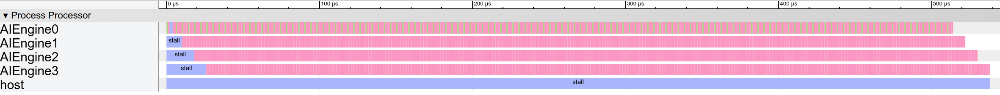

# Optimizing 16 Kernel Implementation

Our bandwidth-constrained model shows that 75% of the hardware’s computation power is wasted, i.e., we stall on 3 of every 4 cycles. 

To balance the system and avoid wasting area and power, a rationale decision is to reduce the 16 processors to 4.

### Structural Modeling 

Let's again change the AI Engine number from 16 down to 4.

```c#
for i in 0 to 4:
    proc = create_proc("AIEngine");
    data = create_mem({32}, 32, "RegisterFile");//delay line
    taps = create_mem({32}, 32, "RegisterFile");//coeff
    acc = create_mem({4}, 32, "RegisterFile");//coeff
	conn_in = connection("Streaming", 32);
	conn_out = connection("Streaming", 32);
	ai_engine = create_comp({"proc", "data", "taps", "acc", "cin","cout"}, 
                            {proc, data, taps, acc, cin, cout};
    aie_array = add_comp({"aie_"+str(i)}, ai_engine)
```


### Control Flow

The implementation now uses 4 kernels and each kernel performs 4 sequential computations. Again, only the communication to the external pipe needs to modeled with `connection` components.

```c#
start = equeue.control_start()
for k in 0 .. 4: // 16 -> 4 kernels
    // 1 -> 4 sequential mac4
    equeue.launch(...) in (start, ai_engine[k]){
        ifmap_tensor = equeue.read(sin, conn_in) // read from external
        equeue.read(ifmap_tensor, ifmap)
        equeue.op("mac4", {ofmap, ifmap, filter})
        equeue.op("mac4", {ofmap, ifmap, filter})
        ofmap_tensor = equeue.read(ofmap);
        equeue.write(ofmap_tensor, sout, conn_out) // write to external
        equeue.op("mac4", {ofmap, ifmap, filter})
        equeue.op("mac4", {ofmap, ifmap, filter})
    }
equeue.await()
```


### How to Run

First use [generator](singleKernel) to generate a 4 kernel of limited bandwidth implementation.

```shell
./bin/equeue-opt -generate=firMulti > [filename].mlir
```

Next step is to simulate the generated MLIR file with

```shell
./bin/equeue-opt [filename].mlir -simulate -show-col-name -json=[json_filename].json 
```


### Simulation and Visualization

We can put on [chrome://tracing](tracing) to visualize the output JSON in [event trace format](https://docs.google.com/document/d/1CvAClvFfyA5R-PhYUmn5OOQtYMH4h6I0nSsKchNAySU/preview).



Our EQueue simulation engine reports that generating 512 outputs requires 538 cycles, which matches Xilinx’s simulator result of 539 cycles. Warm-up takes 26 cycles, which is much faster than the previous case. 

Our detailed operation tracing prove the balance on a 4-processor system: there is no stalling once the processors have warmed up.


### Benefits

This example shows that EQueue simulation can break the boundary of real-word constraints, i.e. it can model *no-bandwidth* constraint and adds on the constraints later. This is opposite to some real-world frustrating experience: one has to build a complex system and then start debugging. 

Such simulation strategy allows invoices to adapt to the system well. The coding overhead is low: one just only needs to modify a little of the the original code at each step. Hopefully it can be a good guide for hardware designers.
