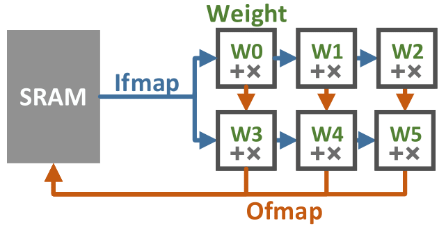
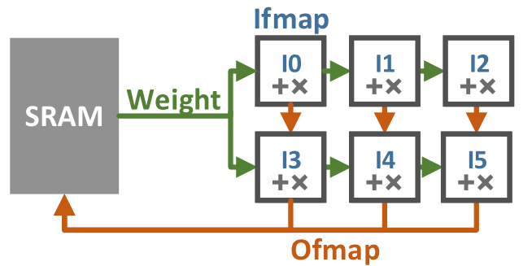
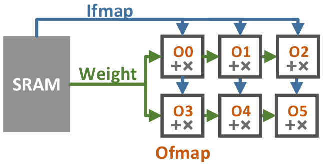

# Systolic Array
In this tutorial, we will introduce how to simulate an input convolution on a systolic array on three different dataflows using 

1) EQueue generator and 

2) Compilation from Linalg dialect.

### Dataflows

The key design decision in a systolic accelerator implementation is the dataflow, which determines how loops in the algorithm are mapped spatially onto **processing elements (PEs)**. 

Here we consider three widely-used dataflows: Weight Stationary (WS), Input Stationary (IS), and Output Stationary (OS). The difference is which tensor remains in each PE’s register file: the weights, input feature map (ifmap), or output feature map (ofmap). 

The idea of simulating convolution originally comes from the paper ["SCALE-Sim: Systolic CNN Accelerator Simulator"](https://arxiv.org/abs/1811.02883) . We reimplement it to illustrate the flexibility of EQueue dialect. One can find detail explanation in their [paper](https://arxiv.org/abs/1811.02883) and [github repo](https://github.com/ARM-software/SCALE-Sim). Here we only introduce them with a brief idea.

Below is the illustration for the data movement of each dataflow on a systolic array. On each cycle, each PE computes a part of final result and passes the partial result to its neighbor.

| Weight Stationary                                            | Input Stationary                                             | Output Stationary                                            |
| ------------------------------------------------------------ | ------------------------------------------------------------ | ------------------------------------------------------------ |
|  |  |  |

Assuming we convolve *N* weights of size *Fh\*Fw* with an ofmap of size *Ew\*Eh* with *C* channels, so that a convolution can be represented as 

> for n in N
>
> ​	for eh in Eh, ew in Ew
>
> ​		for c in C
>
> ​			for fh in Fh, fw in Fw
>
> ​				ofmap[n, eh, ew] += ifmap[ew+fw-1, eh+fh-1,c ] x weight[n, fw, fh, c]

- For WS, on each cycle, ifmaps and ofmaps are passed to the neighbor PEs, while each weight is stationary
  until  *Ew\*Eh* ifmaps convolve with it;
- For IS, at each cycle, weights and ofmaps are passed to the neighbor PEs, while every ifmap is stationary
  until *N* weights convolve with it;
- For OS, at each cycle, ifmaps and weights are passed to the neighbor PEs, while every ofmap is stationary
  until *Fh \* Fw \* C* ifmaps and are convolved.

### Systolic Array Generator

The ideology behind the three dataflows are very similar so I will explain how to implement *Weight Stationary* dataflow. The other two can be found in the same [generator file](SystolicArray.cpp).

#### Structural Modeling

The EQueue file always starts with a **structural modeling** stage. For example, we can create a PE element with a register and put it into a PE array component, a processor (pseudo code):

```c#
pe_array = create_comp()
for aw in arr_width
    for ah in arr_height
        proc = create_proc("AIEngine")
        mem = create_mem({ 4 }, 32, "RegisterFile", 3)
        pe = create_comp({"mem", "proc"}, {mem, proc})
        add_comp(pe_array, {"pe"+str(aw)+"_"+str(wh)}, {pe})
```

Later we can get the register and processor back in control flow with a `get_comp` operation.

Similarly we can create a DMA and put it into a DMA row.

```c#
dma_row = create_comp()
for ah in arr_height
	dma = create_proc("DMA")
    add_comp(pe_row, {"pe"+str(ah)}, {dma})
```

After we create all the components, we only need to assemble them with

```c#
accel = create_comp({"pe_array", "proc", "sram", "dma_row", "dma_col"}, { comp, processor, sram, dma_row, dma_col}) )
```


#### Control Flow

Below we will talk about how to implement the **control flow** of systolic array generator.

To start with, let's think about the pseudo code of WS on a systolic array. At each cycle, the partial sum of ofmap is passed from neighbor PE and the ifmap is passed down to neighour PE.

```c#
pe[i+1][j].ofmap = pe[i][j].ofmap + pe[i][j].ifmap * pe[i][j].weight
pe[i][j+1].ifmap = pe[i][j].ifmap
```

Based on this knowledge, we will build the implementation gradually:

- Parallelization

  - The first thing to show is how to construct parallelism using EQueue dialect. We use MLIR’s builder API,
    which lets C++ code construct MLIR programs. 

  - The following pseudo code shows a generator for a simple parallel architecture:

  - ```
    start = control_start()
    for h in arr_height:
    	for w in arr_width:
    		done = equeue.launch (...) in (start, pe[h][w]){...}
    // assume there is a PE array
    if w ==0 && h==0:
    	prev_done = done
    else:
    	prev_done = equeue.control_and(done, prev_done)
    equeue.await(prev_done)
    ```

  - The for loop iterates over the dimension of the processing element (PE) array ( arr_height by arr_width ). Each PE runs in parallel since they are all “launched” by the same `control_start` event. On each loop, `control_and` collects the launch events of the current and previous PE. An await barrier ensures that the current processor waits for all launch events to finish.

  - In the later pseudo code, we denote this pattern as  `par_for`.

- Systolic passing

  - We next extend the generator to pass values systolically between PEs, i.e. at each cycle, a value is passes to the neighbor PE. 

  - We use two stages: one reads values from a buffer and compute results, and a second stage passes values to neighboring PEs. This generator code shows WS dataflow and omits boundary conditions for simplicity:

  - ```c#
    //reading stage
    par_for (h, w) in 0 to arr_height-1, 0 to arr_width-1:
    	done, weight_value[h][w], ofmap_value[h][w]=
    	equeue.launch( 
    		weight_buffer = pe[h][w].weight_buffer,
    		ifmap_buffer = pe[h][w].ifmap_buffer,
    		ofmap_buffer = pe[h][w].ofmap_buffer)
    	in (start, pe[h][w].kernel) {
            ifmap = equeue.read(ifmap_buffer)
            weight = equeue.read(weight_buffer)
            ofmap_old = equeue.read(ofmap_buffer)
            ofmap = ifmap * weight + ofmap_old
            equeue.return weight, ofmap
        }
    //writing stage
    par_for (h, w) in 1 to arr_height, 1 to arr_width:
        done = equeue.launch(
            weight = weight_value[h][w],
            ofmap = ofmap_value[h][w],
            weight_buffer = pe[h][w+1].weight_buffer,
            ofmap_buffer = pe[h+1][w].ofmap_buffer)
        in (start, pe[h][w].kernel) {
            equeue.write(ofmap, ofmap_buffer)
            equeue.write(weight, weight_buffer)
        }
    ```

  - In the read stage, each PE reads ifmap, weight and ofmap values from corresponding buffers and computes an ofmap.
    In the write stage, the PEs in each column ( pe\[h][w] ) pass weights to the next column ( pe\[h][w+1] ). PEs in a given row write ofmaps to buffers in the next row ( pe\[h+1][w] ).

- Model SRAM Bandwidth:

  - So far, we have a complete and cycle-accurate model of the core PE array logic. The next step is to model the PE array’s interaction with associated SRAMs to measure read and write bandwidth. 

  - Extending our EQueue generator, we can change the launch input in our read stage to make the first column of PEs read from an SRAM:

  - ```c#
    par_for (h, w) in arr_height, arr_width:
        if w == 0: buffer = sram.ifmap_buffer
        else: buffer = pe[h][w].ifmap_buffer
        done, ... = equeue.launch( ifmap_buffer = buffer,
        ...){ ... } // other code same as before
    ```

  - Similarly, we can modify the write stage to store ofmaps from the last row of PEs to an SRAM:

  - ```c#
    par_for (h, w) in arr_height, arr_width:
        if w == arr_height-1: obuffer=sram.ofmap_buffer
        else: obuffer=pe[h+1][w].ofmap_buffer
        done = equeue.launch( ofmap_buffer = obuffer,
        ...) {...} // other code same as before
    ```

    

#### How to Run


