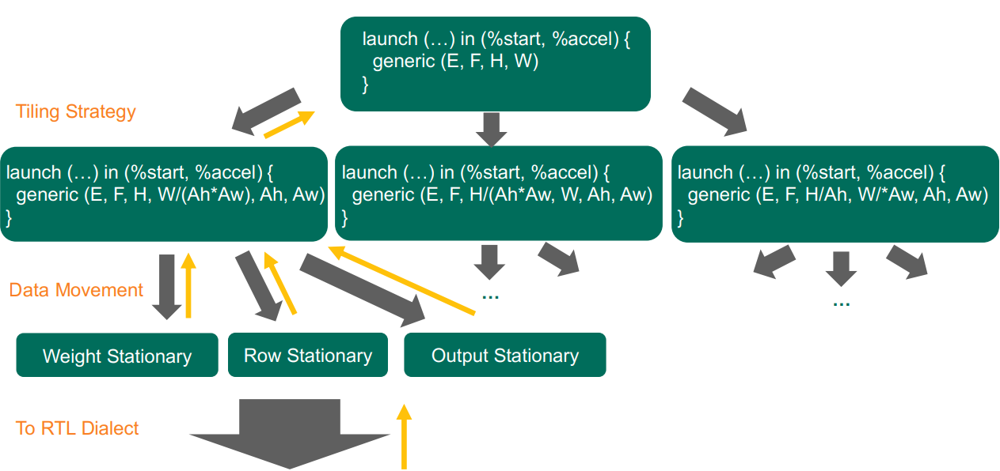

## Passes

This document describes a lot of passes we create in [`Transforms`](../lib/Transforms/)

The motivation to lower high level dialects to equeue dialect comes from the reversing the process: getting detailed simulation at low level dialects first, e.g equeue dialect or RTL implemention, feeding back to high level dialect so that high level dialect runs fast but also with quick simulation results from low levels.



### Starting Point - Linalg Dialect

The starting point would be adding accelerator components to Linalg dialect. 

```mlir
module {
  func @graph(%arg0: memref<7x7xf32>, %arg1: memref<5x5xf32>, %arg2: memref<3x3xf32>) {
    %0 = "equeue.create_proc"() {type = "AIEngine"} : () -> i32
    %1 = "equeue.create_mem"() {banks = 1 : i64, data = "f32", shape = dense<11> : tensor<1xi64>, type = "RegisterFile"} : () -> i32
    %2 = "equeue.create_comp_field"(%0, %1) {names = "proc mem "} : (i32, i32) -> i32
    %3 = splat %2 : vector<5xi32>
    %4 = "equeue.create_mem"() {banks = 16 : i64, data = "f32", shape = dense<1024> : tensor<1xi64>, type = "SRAM"} : () -> i32
    %5 = "equeue.create_dma"() : () -> i32
    %6 = "equeue.create_proc"() {type = "MicroPlate"} : () -> i32
    %7 = "equeue.create_comp_field"(%3, %6, %4, %5) {names = "pe_array proc mem dma "} : (vector<5xi32>, i32, i32, i32) -> i32
    %8 = "equeue.control_start"() : () -> !equeue.signal
    %done = "equeue.launch"(%8, %6, %7, %arg0, %arg1, %arg2) ( {
    ^bb0(%arg3: i32, %arg4: memref<7x7xf32>, %arg5: memref<5x5xf32>, %arg6: memref<3x3xf32>):  // no predecessors
      ...
      linalg.generic {args_in = 2 : i64, args_out = 1 : i64, indexing_maps = [#map5, #map6, #map7], iterator_types = ["parallel", "parallel", "parallel", "parallel", "parallel", "parallel", "parallel"]} %15, %13, %14 {
      ^bb0(%arg7: f32, %arg8: f32, %arg9: f32):  // no predecessors
        %16 = mulf %arg7, %arg8 : f32
        %17 = addf %arg9, %16 : f32
        linalg.yield %17 : f32
      }: memref<1x3x3x1xf32, #map4>, memref<5x5x1x1xf32>, memref<1x3x3x1xf32>
      "equeue.return"() : () -> ()
    }) : (!equeue.signal, i32, i32, memref<7x7xf32>, memref<5x5xf32>, memref<3x3xf32>) -> !equeue.signal
    return
  }
}
```

This is doing a 2D-convolution on an accelerator composed of 5 PEs(processing elements).

### Linalg to Affine Dialect

Apply the mlir official [--convert-linalg-to-affine-loops](https://mlir.llvm.org/docs/Passes/#-convert-linalg-to-affine-loops-lower-the-operations-from-the-linalg-dialect-into-affine-loops), the dialect can be lowered to affine level with   for loops.

### Tiling Affine Dialect

Everything is the same as in [--affine-loop-tile](https://mlir.llvm.org/docs/Passes/#-affine-loop-tile-tile-affine-loop-nests), but please use [--loop-tile](../lib/Transforms/MyLoopTiling.cpp) instead since the official version only applies when affine loops is in the outer most region, but in our case, affine loops are inside launch blocks so we made a little customization on it.

### Allocating Memory inside Affine Loops

We can allocate memory with [--allocate-mem](../lib/Transforms/AllocateMem.cpp) where the parameters are:

**structs_names**: names of structures to allocate memory on, separated by comma. The structure hierarchy is represented with chained @. For example, a field named as *proc* inside *pe* and the *pe* is a field of a *pe_array* can be represented by "pe_array@pe@proc". This allows to all **\*_names** options.

**mem_names**: names of buffers to be allocated, separated by comma.

**sizes**: sizes of buffers to be allocated, separated by comma.

**indices**: indices of regions to allocate buffers in pre-order, separated by comma.

### Memory Movement inside Affine Loops

We can copy between buffers with [--mem-copy](../lib/Transforms/MemCopy.cpp). This passes will add `equeue.memcpy`to required region.

The parameters are:

**src_names**: names of source buffers in the memory copy process, separated by comma.

**dest_names**: names of destination buffers in the memory copy process, separated by comma.

**dma_names**: names of kernel to handle the memory copy operation to be allocated, separated by comma.

**indices**: indices of regions to allocate buffers in pre-order, separated by comma.

### Structure Matching Pass

This pass tries to launch processors on the given region. The original region is moved into launch operation. In this step, the high level processor tries to deliver works to low level processors. 

The parameters are:

**structs_names**: names of processors to launch operations, separated by comma.

**indices**: indices of regions to allocate buffers in pre-order, separated by comma.


